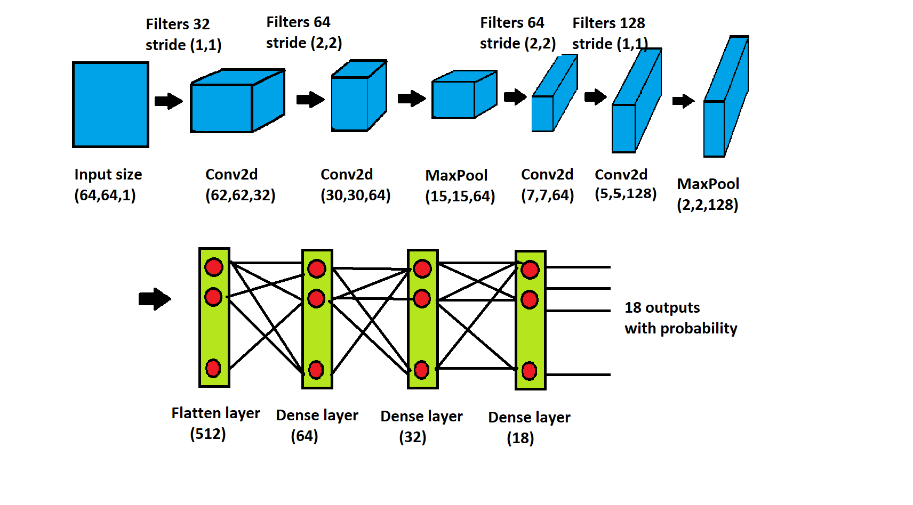

# Gesture_enabled_Basic_calculator
This repo contains gesture enabled calculator capable of performing addition (+) , subtraction ( - ) , multiplication ( * ) , division( / ) , exponent ( ^ ) , modulo ( % ).

Once Gesture is shown for the numbers , show gestures for the opeartor and then again gesture for another number . Finally show "confrm" gesture to get the result.

